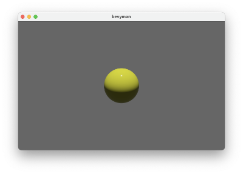
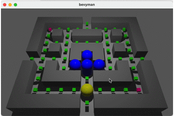
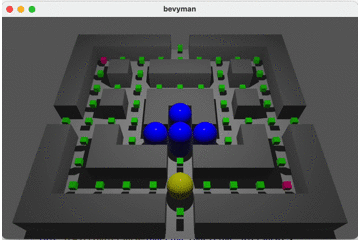
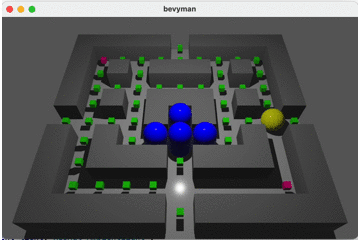
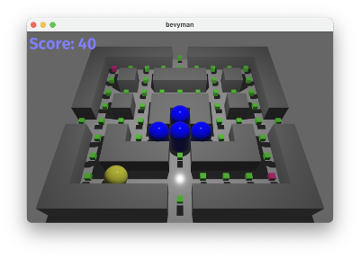
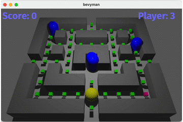
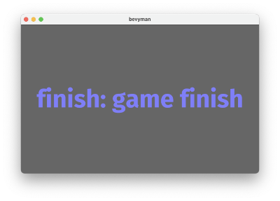

# bevyman - creating a 3D game with rust and bevy

My first 3D game with rust(https://www.rust-lang.org) and the bevy framework(https://bevyengine.org).

I am inspired by the classic computer game #pacman.

## 1. Step _ using a sphere as player

<br><br><br><br><br><br><br><br>


```Rust
extern crate bevy;
use bevy::prelude::*;

#[derive(Component)]
struct Player;

....

commands.spawn_bundle(PbrBundle{
mesh: meshes.add(Mesh::from(shape::Icosphere { radius: 0.50, subdivisions: 32, })),
material:materials.add(Color::YELLOW.into()),
transform: Transform::from_xyz(0., 0., 0. ),
..Default::default()
})
.insert(Player);
```

## 2. Step _ add game grid

<br><br><br><br><br><br><br><br>


```Rust
struct Gamegrid {
    value: [[Gameobject;11];10] //col row
}
impl Default for Gamegrid{
    fn default() -> Self {
        use self::Gameobject::*;
        Self {
            value:[[WallObject,WallObject,WallObject,WallObject,WallObject,FoodObject,WallObject,WallObject,WallObject,WallObject,WallObject],
                   [WallObject,PowerObject,FoodObject,FoodObject,FoodObject,FoodObject,FoodObject,FoodObject,FoodObject,FoodObject,WallObject],
                   ...
                   [WallObject,FoodObject,FoodObject,FoodObject,FoodObject,Bevyman,FoodObject,FoodObject,FoodObject,PowerObject,WallObject],
                   [WallObject,WallObject,WallObject,WallObject,WallObject,FoodObject,WallObject,WallObject,WallObject,WallObject,WallObject]]
        }
    }
}
```


```Rust
....
for (y, row) in gamegrid.value.iter().enumerate() {
        for (x, col) in row.iter().enumerate() {
            match col {
                Gameobject::Bevyman => { 
                    commands.spawn_bundle(PbrBundle{
                        mesh: meshes.add(Mesh::from(shape::Icosphere { radius: 0.50, subdivisions: 32, })),
                        material:materials.add(Color::YELLOW.into()),
                        transform: Transform::from_translation(gamegrid.to3d(x,y,0.5)),
                        ..Default::default()
                    })
                    .insert(Player);
                },
                Gameobject::FoodObject => {
                    commands.spawn_bundle(PbrBundle
```

## 3. Step _ move player without collision

<br><br><br><br><br><br><br><br>


```Rust
fn move_player(
    time:Res<Time>,
    keyboard_input:Res<Input<KeyCode>>,
    mut query: Query<(&mut Transform, With<Player>)>
){
    for (mut transform,_) in query.iter_mut() {
        let mut direction = Vec3::new(0.,0.,0.);
        if keyboard_input.pressed(KeyCode::Left) {
            direction = Vec3::new(-1.0,0.,0.)
        } else if keyboard_input.pressed(KeyCode::Right) {
            direction = Vec3::new(1.0,0.,0.)
        } else if keyboard_input.pressed(KeyCode::Up) {
            direction = Vec3::new(0.,0.,-1.)
        } else if keyboard_input.pressed(KeyCode::Down) {
            direction = Vec3::new(0.,0.,1.)
        }
        transform.translation = transform.translation + direction * PLAYER_SPEED * time.delta_seconds();
    }  
}
```

## 4. Step _ player collides with wall and food

<br><br><br><br><br><br><br><br>


```Rust
   // wall -> back to old position
    if gamegrid.wall_in_distance(transform.translation,0.4) {
       transform.translation = collidable.old_position.clone();
    } else {
        collidable.old_position = transform.translation.clone();
    }
    // food -> eat
    if gamegrid.food_at_pos(transform.translation) {

        for (e, food_transform, _,_) in food_query.iter(){
            if food_transform.translation.distance(transform.translation)<0.2{
                commands.entity(e).despawn();
                let x = gamegrid.to_map_x(food_transform.translation.x, food_transform.translation.y, food_transform.translation.z);
                let y = gamegrid.to_map_y(food_transform.translation.x, food_transform.translation.y, food_transform.translation.z);
                gamegrid.value[y][x]=Gameobject::Empty;
            }
            
        }
        score.foodcounter -=1;
        if score.foodcounter == 0 {
            //win
        }
        score.points += 20;
    }
```

## 5. Step _ player teleports

<br><br><br><br><br><br><br><br>


```Rust
    if transform.translation.x > gamegrid.max_x {
        transform.translation.x = gamegrid.min_x;
    } else if transform.translation.x < gamegrid.min_x {
        transform.translation.x = gamegrid.max_x;
    }
    if transform.translation.z > gamegrid.max_z {
        transform.translation.z = gamegrid.min_z;
    } else if transform.translation.z < gamegrid.min_z {
        transform.translation.z = gamegrid.max_z;
    }
```

## 6. Step _ show score

<br><br><br><br><br><br><br><br>


```Rust
commands.spawn_bundle(TextBundle {
        text: Text::with_section(
            "Score:",
            TextStyle {
                font: asset_server.load("fonts/FiraSans-Bold.ttf"),
                font_size: 40.0,
                color: Color::rgb(0.5, 0.5, 1.0),
            },
            Default::default(),
        ),
        style: Style {
            position_type: PositionType::Absolute,
            position: Rect {
                top: Val::Px(5.0),
                left: Val::Px(5.0),
                ..Default::default()
            },
            ..Default::default()
        },
        ..Default::default()
    });

```


```Rust
fn scoreboard(
    score: Res<Score>, 
    mut query: Query<&mut Text>
) {
    let mut text = query.single_mut();
    text.sections[0].value = format!("Score: {}", score.points);
}
```

## 7. Step _ move random ghosts

<br><br><br><br><br><br><br><br>


```Rust
for (mut transform, mut collidable, mut direction, _) in query.iter_mut() {
        if direction.value.x == 0.0 && direction.value.y == 0.0 && direction.value.z == 0.0 { 
            let mut rng = rand::thread_rng();
            match rng.gen_range(0..4) {
                0 => {
                    direction.value = Vec3::new(-1.0, 0.0, 0.0)
                    //ghosts[i].mesh.rotation.y = -90 * Math.PI / 180;
                }
                1 => {
                    direction.value = Vec3::new(1.0, 0.0, 0.0);
                    //ghosts[i].mesh.rotation.y = 90 * Math.PI / 180;
                }
                2 => {
                    direction.value = Vec3::new(0.0, 0.0, -1.0);
                    //ghosts[i].mesh.rotation.y = 180 * Math.PI / 180;
                }
                3 => {
                    direction.value = Vec3::new(0.0, 0.0, 1.0);
                    //ghosts[i].mesh.rotation.y = 0 * Math.PI / 180;
                }
                _ => {}
            }
        }

        collidable.old_position = transform.translation.clone();

        transform.translation = transform.translation + direction.value * GHOST_SPEED * time.delta_seconds();
    }
```

## 8. Step _ game finish

<br><br><br><br><br><br><br><br>


```Rust
App::new()
    //add config resources
    .insert_resource(Msaa {samples: 4})
    .insert_resource(WindowDescriptor{
        title: "bevyman".to_string(),
        width: 640.0,
        height: 400.0,
        vsync: true,
        ..Default::default()
    })
    .insert_resource(Gamegrid::default())
    .insert_resource(Score::default())
    //bevy itself
    .add_plugins(DefaultPlugins)
    .add_state(Gamestate::Play)
    .add_startup_system(setup)
    .add_system_set(
        SystemSet::on_update(Gamestate::Play)
            .with_system(move_player)
            .with_system(move_ghost)
            .with_system(collision)
            .with_system(collision_ghost)
            .with_system(scoreboard),
    )
    .add_system_set(SystemSet::on_exit(Gamestate::Play).with_system(teardown))
    .add_system_set(SystemSet::on_enter(Gamestate::Finish).with_system(display_finish))
    .run();
```
