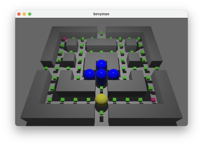

# bevyman - creating a 3D game with rust and bevy

My first 3D game with rust(https://www.rust-lang.org) and the bevy framework(https://bevyengine.org).

I am inspired by the classic computer game #pacman.

## 1. Step _ using a sphere as player

<br><br><br><br><br><br><br><br>


```Rust
extern crate bevy;
use bevy::prelude::*;

#[derive(Component)]
struct Player;

....

commands.spawn_bundle(PbrBundle{
        mesh: meshes.add(Mesh::from(shape::Icosphere { radius: 0.50, subdivisions: 32, })),
        material:materials.add(Color::YELLOW.into()),
        transform: Transform::from_xyz(0., 0., 0. ),
        ..Default::default()
    })
    .insert(Player);
```

## 2. Step _ add game grid 

<br><br><br><br><br><br><br><br>


```Rust
struct Gamegrid {
    value: [[Gameobject;11];10] //col row
}
impl Default for Gamegrid{
    fn default() -> Self {
        use self::Gameobject::*;
        Self {
            value:[[WallObject,WallObject,WallObject,WallObject,WallObject,FoodObject,WallObject,WallObject,WallObject,WallObject,WallObject],
                   [WallObject,PowerObject,FoodObject,FoodObject,FoodObject,FoodObject,FoodObject,FoodObject,FoodObject,FoodObject,WallObject],
                   ...
                   [WallObject,FoodObject,FoodObject,FoodObject,FoodObject,Bevyman,FoodObject,FoodObject,FoodObject,PowerObject,WallObject],
                   [WallObject,WallObject,WallObject,WallObject,WallObject,FoodObject,WallObject,WallObject,WallObject,WallObject,WallObject]]
        }
    }
}
```


```Rust
....
for (y, row) in gamegrid.value.iter().enumerate() {
        for (x, col) in row.iter().enumerate() {
            match col {
                Gameobject::Bevyman => { 
                    commands.spawn_bundle(PbrBundle{
                        mesh: meshes.add(Mesh::from(shape::Icosphere { radius: 0.50, subdivisions: 32, })),
                        material:materials.add(Color::YELLOW.into()),
                        transform: Transform::from_translation(gamegrid.to3d(x,y,0.5)),
                        ..Default::default()
                    })
                    .insert(Player);
                },
                Gameobject::FoodObject => {
                    commands.spawn_bundle(PbrBundle
```

## 3. Step _ move player without collision

<br><br><br><br><br><br><br><br>


```Rust
fn move_player(
    time:Res<Time>,
    keyboard_input:Res<Input<KeyCode>>,
    mut query: Query<(&mut Transform, With<Player>)>
){
    for (mut transform,_) in query.iter_mut() {
        let mut direction = Vec3::new(0.,0.,0.);
        if keyboard_input.pressed(KeyCode::Left) {
            direction = Vec3::new(-1.0,0.,0.)
        } else if keyboard_input.pressed(KeyCode::Right) {
            direction = Vec3::new(1.0,0.,0.)
        } else if keyboard_input.pressed(KeyCode::Up) {
            direction = Vec3::new(0.,0.,-1.)
        } else if keyboard_input.pressed(KeyCode::Down) {
            direction = Vec3::new(0.,0.,1.)
        }
        transform.translation = transform.translation + direction * PLAYER_SPEED * time.delta_seconds();
    }  
}
```
